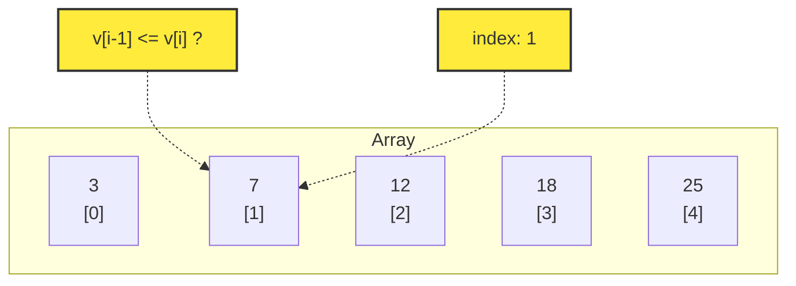
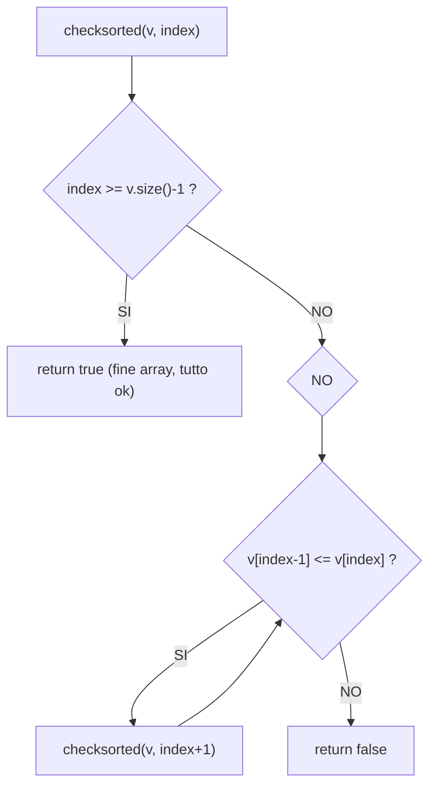

# Esercitazione 2 
Dato un vettore, verificare che sia in ordine crescente 

- Vettore vuoto e vettore con 1 elemento sono sempre ordinati. 
- `index = l'indice` da cui devo iniziare la verifica

## Visualizzazione del Vettore


Produce:



## Logica Ricorsiva



## Codice

```cpp
bool checksorted(const vector<int> &v, int index) {
    if (index >= v.size()-1)
        return true
    else if(v.at(index)>v.at(index+1)) 
        return false;
    else
        return checksorted(v,index+1);
}
```

> **Chiamata iniziale:** `checksorted(v, 1)` — si parte da 1 perché confrontiamo `v[index-1]` con `v[index]`

## Count subeset 
Dato un vettore di interi `v` ed un intero `target` conta quanti sottoinsiemi di `v` hanno una somma uguale a `target`

### suggerimento:
- il sottoinsime vuoto ha somma pari a 0, viene contato solo se `target= 0`

#### parametri:
- Vettore`v`
- Index $\rightarrow$ l'indice dell'elemento che sto considerando
- target $\rightarrow$ la somma che sto considerando.

``` cpp
int countsubsets(const vector <int>& v ,int index,int target){
    if(index >= v.size())
        return target == 0? 1:0;
    else
        countsubests(v,index+1,target-v.at(index))+ countsubests(v,index+1,target);
}
```

## Probelma del grattacielo 


Un grattacielo ha `n` piani. Ogni piano può essere colorato di **bianco** o di **nero**, rispettando le seguenti regole:

- Non è possibile colorare **due piani consecutivi** entrambi di nero
- Ogni piano `i` offre una somma `v[i]` che viene incassata **solo se** il piano viene colorato di nero

L'obiettivo è scegliere la colorazione che **massimizza il guadagno totale**.

---

### Firma

```cpp
int grattacielo(const vector<int>& v, int piano, colore c);
```

dove `colore` è definito come:

```cpp
enum colore { bianco, nero };
```

---

### Parametri

- `v` — vettore delle offerte: `v[i]` rappresenta quanto paga il piano `i` se colorato di nero.
  In particolare, `v[0]` indica quanto paga il piano terra.
- `piano` — indice del **prossimo piano** di cui bisogna decidere il colore
- `c` — colore assegnato al piano **precedente** (`piano - 1`), necessario per verificare
  il vincolo sui piani consecutivi

---

### Obiettivo

Restituire il **guadagno massimo** ottenibile colorando i piani da `piano` fino all'ultimo (`n - 1`),
sapendo che il piano precedente è stato colorato con il colore `c`.

---

<!-- ### Vincolo chiave

Se `c == nero`, allora il piano corrente **deve** essere colorato di bianco (guadagno 0).
Se `c == bianco`, si può scegliere liberamente tra bianco (guadagno 0) e nero (guadagno `v[piano]`). -->