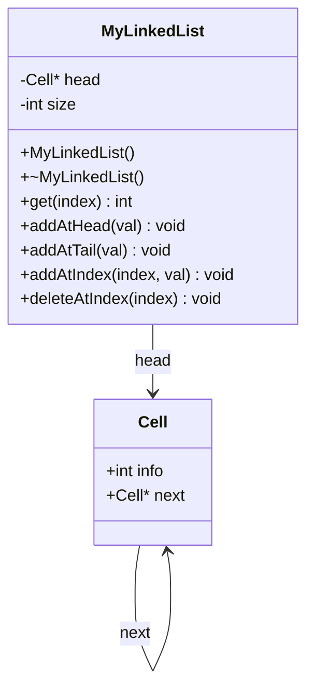
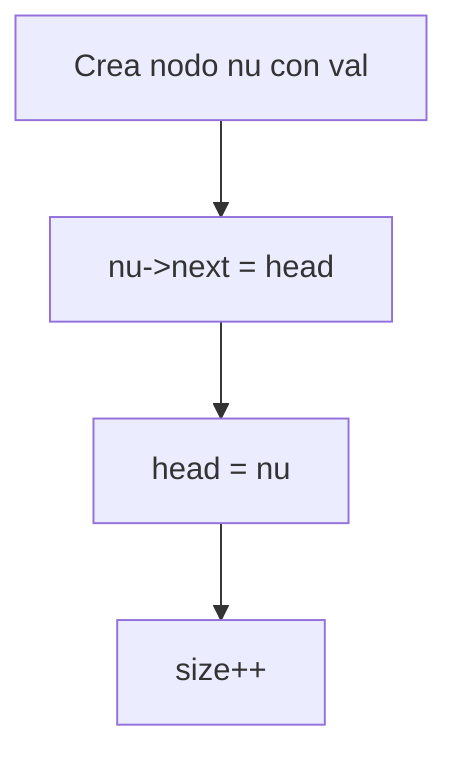
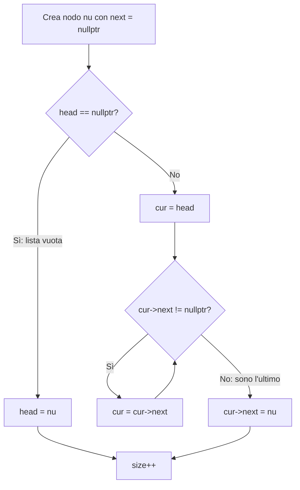
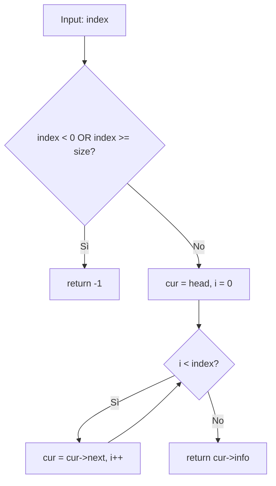
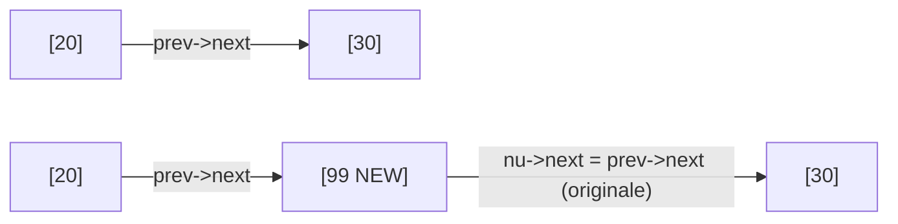
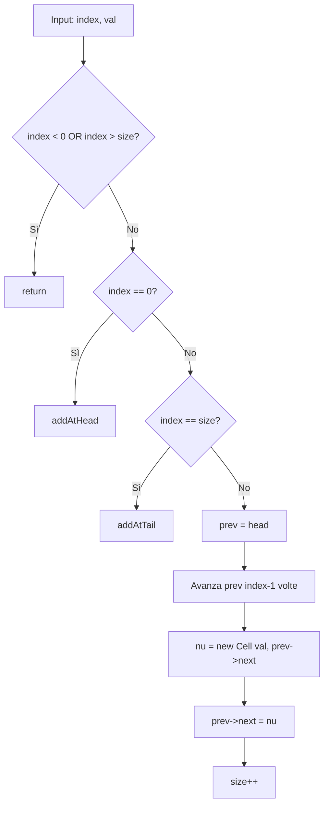
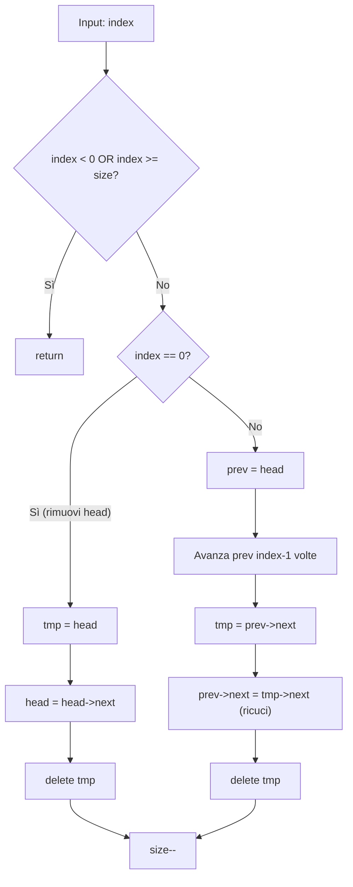
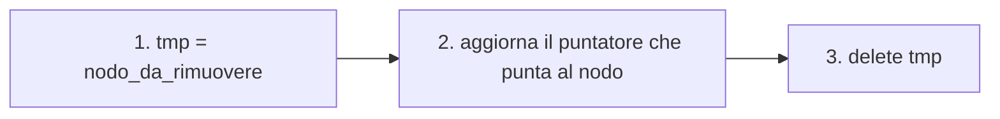
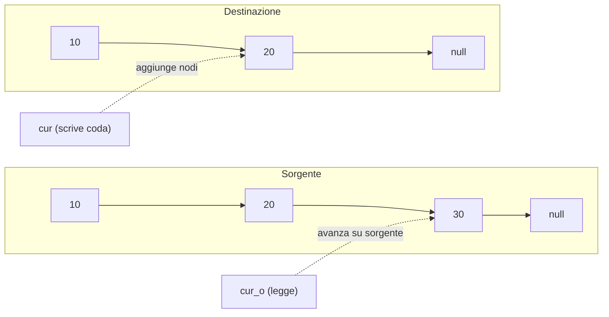

# MyLinkedList – Guida visuale

## 1. La struttura dati



Una `Cell` contiene un valore (`info`) e un puntatore al prossimo nodo. La classe `MyLinkedList` tiene un puntatore al primo nodo (`head`) e un contatore (`size`).

**Lista vuota**: `head = nullptr`, `size = 0`.

**Lista con 3 elementi**:

```
head → [10|•] → [20|•] → [30|∅]

           size = 3
```

---

## 2. `addAtHead(val)` — O(1)

Inserimento in testa: il nuovo nodo diventa il primo.

### Prima
```
head → [20|•] → [30|∅]
```

### Dopo `addAtHead(10)`
```
head → [10|•] → [20|•] → [30|∅]
```

### Diagramma di flusso



### Punto chiave
Il nuovo nodo punta a quello che *era* l'head. Poi `head` si sposta sul nuovo nodo. È O(1) perché non scorre niente.

---

## 3. `addAtTail(val)` — O(n)

Inserimento in coda: bisogna scorrere fino all'ultimo nodo.

### Prima
```
head → [10|•] → [20|∅]
```

### Dopo `addAtTail(30)`
```
head → [10|•] → [20|•] → [30|∅]
```

### Due casi



### Punto chiave
Il nuovo nodo ha `next = nullptr` perché è l'ultimo. Non deve mai puntare a `head` (sarebbe un ciclo!).

---

## 4. `get(index)` — O(n)

Scorre fino alla posizione `index` e ritorna il valore.

### Esempio: `get(2)` su `[10, 20, 30, 40]`

```
head → [10|•] → [20|•] → [30|•] → [40|∅]
  i=0      i=1     i=2     i=3

cur parte da head (i=0), avanza 2 volte, ritorna 30.
```

### Diagramma di flusso



### Punto chiave
Partendo da posizione 0 (`cur = head`), per arrivare a posizione `index` servono **esattamente `index` avanzamenti**.

---

## 5. `addAtIndex(index, val)` — O(n)

Inserisce un nodo **prima** del nodo attualmente in posizione `index`.

### Esempio: `addAtIndex(2, 99)` su `[10, 20, 30, 40]`

```
Prima:    head → [10|•] → [20|•] → [30|•] → [40|∅]
                    0       1       2       3

prev deve essere il nodo in posizione index-1 = 1 (valore 20)

Dopo:     head → [10|•] → [20|•] → [99|•] → [30|•] → [40|∅]
                                    ↑
                                 inserito
```

### Operazione di inserimento



### Flusso completo



### Punto chiave
- **Validazione**: `index > size` è invalido, ma `index == size` è VALIDO (inserisci in coda).
- Il nuovo nodo `nu->next` deve puntare al **vecchio** `prev->next` (cioè al nodo che *era* in posizione `index`).

---

## 6. `deleteAtIndex(index)` — O(n)

Rimuove il nodo in posizione `index`.

### Esempio: `deleteAtIndex(1)` su `[10, 20, 30, 40]`

```
Prima:    head → [10|•] → [20|•] → [30|•] → [40|∅]
                    0       1       2       3

prev deve essere il nodo in posizione index-1 = 0 (valore 10)
tmp  deve essere prev->next (il nodo da cancellare, valore 20)

Passo 1 - salva tmp:
          prev → [10|•] → [20|•] → [30|•] → [40|∅]
                          ↑
                         tmp

Passo 2 - ricuci (prev->next = tmp->next):
                 [10|•] ────────→ [30|•] → [40|∅]
                           
                           [20|•]  ← tmp (orfano)

Passo 3 - delete tmp:
          head → [10|•] → [30|•] → [40|∅]
```

### Due casi



### Punto chiave: l'ordine conta!

```
1. Cell* tmp = prev->next   // salva
2. prev->next = tmp->next   // ricuci
3. delete tmp                // libera
```

Se invertissi:
- `delete` prima di `ricuci` → use-after-free quando accedi a `tmp->next`
- `ricuci` prima di `salva` → perdi il riferimento al nodo da cancellare

---

## 7. Regole mnemoniche

### Validazione: `>` vs `>=`

| Operazione | Invalido se... | Perché |
|---|---|---|
| `get(index)` | `index >= size` | Non esiste la posizione |
| `deleteAtIndex(index)` | `index >= size` | Non puoi cancellare il vuoto |
| `addAtIndex(index, val)` | `index > size` | Puoi inserire `== size` (in coda) |

### Pattern di rimozione (sempre questo, sempre in quest'ordine)



### Contatore `size`: quando si tocca

| Metodo | Azione su size |
|---|---|
| `addAtHead` | `size++` |
| `addAtTail` | `size++` |
| `addAtIndex` | `size++` (anche quando delega a addAtHead/Tail: lo fanno loro) |
| `deleteAtIndex` | `size--` |

**Attenzione**: in `addAtIndex`, quando deleghi ad `addAtHead` o `addAtTail`, NON fare di nuovo `size++` nel codice tuo! Se ne occupa la funzione chiamata. Fai `return;` subito dopo.

---

## 8. Complessità

| Metodo | Tempo | Note |
|---|---|---|
| `get(index)` | O(n) | scorre fino a index |
| `addAtHead` | O(1) | nessuno scorrimento |
| `addAtTail` | O(n) | scorre fino alla fine |
| `addAtIndex` | O(n) | scorre fino a index-1 |
| `deleteAtIndex` | O(n) | scorre fino a index-1 |
| Costruttore copia | O(n) | copia tutti i nodi |
| Distruttore | O(n) | cancella tutti i nodi |

**Spazio**: O(n) totale, O(1) per ogni singola operazione (tranne la copia).

---

## 9. I bug classici da evitare

| Bug | Sintomo | Come evitarlo |
|---|---|---|
| `;` dopo `for`/`if` | Il corpo viene eseguito una volta sola | Usa sempre `{}` |
| `=` invece di `==` | Assegnazione invece di confronto | Leggi ad alta voce "è uguale a" |
| `Cell` invece di `Cell*` | Tipo sbagliato nella dichiarazione | `new Cell{}` dà un `Cell*`, a sinistra serve `Cell*` |
| Dimenticare `size++/--` | `get` ritorna -1 anche con elementi | Checklist mentale a fine funzione |
| Dimenticare `return` dopo validazione | Codice eseguito con input invalido | Metti sempre `return` subito dopo l'if di validazione |
| `nu` e `nuovo` nello stesso scope | Compiler error | Un nome solo, usa l'autocompletamento |
| `list` vs `lista` | Conflitto con `std::list` | Evita typedef per puntatori, o usa nomi univoci |

---

## 10. Pattern del "puntatore tail" (per la copia profonda)

Nel copy constructor usi **due puntatori**:



- `cur_o` itera sulla sorgente (lettura)
- `cur` è la **coda** della lista in costruzione (scrittura in O(1))

Se non avessi `cur` e ogni volta cercassi la coda con un `while(->next != nullptr)`, sarebbe O(n²). Con `cur` tenuto aggiornato, sei O(n).

---

## 11. Codice completo

```cpp
class MyLinkedList {
private:
    struct Cell {
        int info;
        Cell* next;
    };

    typedef Cell* lista;
    lista head;
    int size;

public:
    // Costruttore: lista vuota
    MyLinkedList() {
        head = nullptr;
        size = 0;
    }

    // Distruttore: libera tutti i nodi
    ~MyLinkedList() {
        while (head != nullptr) {
            lista tmp = head;
            head = head->next;
            delete tmp;
        }
    }

    // Copy constructor: deep copy con pattern "due puntatori"
    MyLinkedList(const MyLinkedList& other) {
        head = nullptr;
        lista cur = nullptr;           // coda della nuova lista
        lista cur_o = other.head;       // iteratore sulla sorgente
        size = other.size;
        while (cur_o != nullptr) {
            lista nuova = new Cell{cur_o->info, nullptr};
            if (head == nullptr) {
                head = nuova;
                cur = nuova;
            } else {
                cur->next = nuova;
                cur = cur->next;
            }
            cur_o = cur_o->next;
        }
    }

    // Ritorna il valore in posizione index, -1 se invalido
    int get(int index) {
        if (index < 0 || index >= size) return -1;
        lista cur = head;
        for (int i = 0; i < index; i++)
            cur = cur->next;
        return cur->info;
    }

    // Inserisce in testa — O(1)
    void addAtHead(int val) {
        lista nu = new Cell{val, head};
        head = nu;
        size++;
    }

    // Inserisce in coda — O(n)
    void addAtTail(int val) {
        lista cur = head;
        lista nu = new Cell{val, nullptr};
        if (cur == nullptr) {
            head = nu;
        } else {
            while (cur->next != nullptr)
                cur = cur->next;
            cur->next = nu;
        }
        size++;
    }

    // Inserisce prima del nodo in posizione index
    void addAtIndex(int index, int val) {
        if (index < 0 || index > size) return;  // nota: > size, non >=
        
        if (index == 0) {
            addAtHead(val);
            return;
        }
        if (index == size) {
            addAtTail(val);
            return;
        }
        
        lista prev = head;
        for (int i = 0; i < index - 1; i++)
            prev = prev->next;
        lista nu = new Cell{val, prev->next};
        prev->next = nu;
        size++;
    }

    // Rimuove il nodo in posizione index
    void deleteAtIndex(int index) {
        if (index < 0 || index >= size) return;
        
        if (index == 0) {
            lista tmp = head;
            head = head->next;
            delete tmp;
        } else {
            lista prev = head;
            for (int i = 0; i < index - 1; i++)
                prev = prev->next;
            lista tmp = prev->next;
            prev->next = tmp->next;   // ricuci
            delete tmp;
        }d
        size--;
    }
};
```

---

## 12. Istruzioni d'uso (LeetCode)

```cpp
MyLinkedList* obj = new MyLinkedList();
int param_1 = obj->get(index);
obj->addAtHead(val);
obj->addAtTail(val);
obj->addAtIndex(index, val);
obj->deleteAtIndex(index);
```